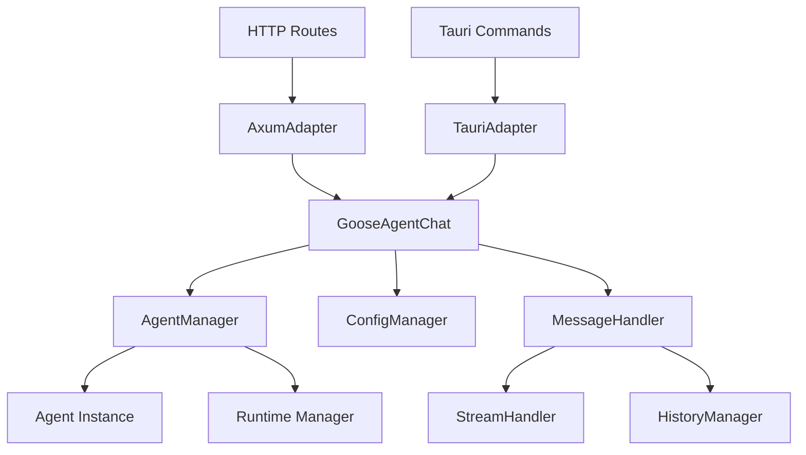

# Design Document

## Overview

The goose-agent-chat module provides a universal interface for AI agent chat functionality using the goose framework. The design focuses on creating a flexible, thread-safe module that can be seamlessly integrated into both axum web applications and tauri desktop applications while maintaining consistent behavior and API surface.

The module leverages the goose framework's Agent and streaming capabilities, providing both synchronous and asynchronous interfaces for different use cases. It implements a singleton pattern for agent management and provides adapter patterns for different deployment contexts.

## Architecture

### Core Components



### Module Structure

The module is organized into the following key components:

1. **Core Agent Manager**: Manages the goose Agent lifecycle and configuration
2. **Message Processing**: Handles chat requests, responses, and streaming
3. **Adapter Layer**: Provides platform-specific interfaces for axum and tauri
4. **Configuration System**: Manages agent settings and provider configuration
5. **Error Handling**: Unified error types and handling across platforms

## Components and Interfaces

### 1. Core Agent Manager

```rust
pub struct GooseAgentManager {
    agent: OnceCell<Agent>,
    runtime: Arc<Runtime>,
    config: AgentConfig,
}

impl GooseAgentManager {
    pub fn new(config: AgentConfig) -> Result<Self, GooseError>;
    pub fn get_agent(&self) -> Result<&Agent, GooseError>;
    pub async fn send_message(&self, message: &str) -> Result<String, GooseError>;
    pub async fn send_message_stream(&self, message: &str) -> Result<impl Stream<Item = String>, GooseError>;
}
```

### 2. Configuration System

```rust
#[derive(Debug, Clone)]
pub struct AgentConfig {
    pub model_config: ModelConfig,
    pub provider_config: ProviderConfig,
    pub chat_config: ChatConfig,
}

#[derive(Debug, Clone)]
pub struct ChatConfig {
    pub max_history_length: usize,
    pub enable_streaming: bool,
    pub timeout_seconds: u64,
    pub system_prompt: Option<String>,
}

impl Default for AgentConfig {
    fn default() -> Self;
}
```

### 3. Message Processing

```rust
#[derive(Debug, Clone, Serialize, Deserialize)]
pub struct ChatMessage {
    pub id: String,
    pub content: String,
    pub role: MessageRole,
    pub timestamp: u64,
}

#[derive(Debug, Clone, Serialize, Deserialize)]
pub enum MessageRole {
    User,
    Assistant,
    System,
}

pub struct MessageHandler {
    history: Arc<Mutex<Vec<ChatMessage>>>,
    config: ChatConfig,
}

impl MessageHandler {
    pub fn new(config: ChatConfig) -> Self;
    pub fn add_message(&self, message: ChatMessage);
    pub fn get_history(&self) -> Vec<ChatMessage>;
    pub fn clear_history(&self);
    pub fn truncate_history(&self);
}
```

### 4. Streaming Support

```rust
pub struct StreamResponse {
    pub chunk: String,
    pub is_complete: bool,
    pub error: Option<String>,
}

pub trait StreamHandler {
    async fn handle_stream(&self, stream: impl Stream<Item = AgentEvent>) -> impl Stream<Item = StreamResponse>;
}
```

### 5. Platform Adapters

#### Axum Adapter

```rust
pub struct AxumChatAdapter {
    manager: Arc<GooseAgentManager>,
    message_handler: Arc<MessageHandler>,
}

impl AxumChatAdapter {
    pub fn new(config: AgentConfig) -> Result<Self, GooseError>;
    pub async fn handle_chat_request(&self, request: ChatRequest) -> Result<ChatResponse, GooseError>;
    pub async fn handle_stream_request(&self, request: ChatRequest) -> Result<impl Stream<Item = StreamResponse>, GooseError>;
}

#[derive(Deserialize)]
pub struct ChatRequest {
    pub message: String,
    pub conversation_id: Option<String>,
    pub stream: Option<bool>,
}

#[derive(Serialize)]
pub struct ChatResponse {
    pub response: String,
    pub conversation_id: String,
    pub timestamp: u64,
}
```

#### Tauri Adapter

```rust
pub struct TauriChatAdapter {
    manager: Arc<GooseAgentManager>,
    message_handler: Arc<MessageHandler>,
}

impl TauriChatAdapter {
    pub fn new(config: AgentConfig) -> Result<Self, GooseError>;
    pub async fn send_message(&self, message: String) -> Result<String, GooseError>;
    pub async fn send_message_stream(&self, message: String, window: tauri::Window) -> Result<(), GooseError>;
    pub fn get_conversation_history(&self) -> Result<Vec<ChatMessage>, GooseError>;
    pub fn clear_conversation(&self) -> Result<(), GooseError>;
}
```

## Data Models

### Core Data Structures

```rust
#[derive(Debug, Clone, Serialize, Deserialize)]
pub struct Conversation {
    pub id: String,
    pub messages: Vec<ChatMessage>,
    pub created_at: u64,
    pub updated_at: u64,
}

#[derive(Debug, Clone)]
pub enum ProviderConfig {
    Databricks {
        endpoint: String,
        token: String,
        model: String,
    },
    OpenAI {
        api_key: String,
        model: String,
        base_url: Option<String>,
    },
    // Extensible for other providers
}
```

### Error Types

```rust
#[derive(Debug, thiserror::Error)]
pub enum GooseError {
    #[error("Agent initialization failed: {0}")]
    InitializationError(String),
    
    #[error("Configuration error: {0}")]
    ConfigError(String),
    
    #[error("Message processing error: {0}")]
    MessageError(String),
    
    #[error("Streaming error: {0}")]
    StreamError(String),
    
    #[error("Runtime error: {0}")]
    RuntimeError(String),
}
```

## Error Handling

### Error Strategy

1. **Graceful Degradation**: When streaming fails, fall back to non-streaming responses
2. **Retry Logic**: Implement exponential backoff for transient failures
3. **Error Propagation**: Use structured error types that can be serialized for web/tauri responses
4. **Logging**: Comprehensive logging at different levels (debug, info, warn, error)

### Error Recovery

```rust
impl GooseAgentManager {
    async fn send_message_with_retry(&self, message: &str, max_retries: u32) -> Result<String, GooseError> {
        let mut attempts = 0;
        let mut delay = Duration::from_millis(100);
        
        loop {
            match self.send_message(message).await {
                Ok(response) => return Ok(response),
                Err(e) if attempts < max_retries => {
                    attempts += 1;
                    tokio::time::sleep(delay).await;
                    delay *= 2; // Exponential backoff
                }
                Err(e) => return Err(e),
            }
        }
    }
}
```

## Testing Strategy

### Unit Testing

1. **Agent Manager Tests**: Test agent initialization, configuration, and basic message handling
2. **Message Handler Tests**: Test history management, truncation, and thread safety
3. **Configuration Tests**: Test default configurations and validation
4. **Error Handling Tests**: Test error scenarios and recovery mechanisms

### Integration Testing

1. **Axum Integration**: Test HTTP endpoints with real agent responses
2. **Tauri Integration**: Test tauri commands and event emission
3. **Streaming Tests**: Test streaming functionality across both platforms
4. **Concurrency Tests**: Test thread safety under concurrent load

### Test Structure

```rust
#[cfg(test)]
mod tests {
    use super::*;
    
    #[tokio::test]
    async fn test_agent_initialization() {
        // Test agent setup with default config
    }
    
    #[tokio::test]
    async fn test_message_processing() {
        // Test basic message send/receive
    }
    
    #[tokio::test]
    async fn test_streaming_response() {
        // Test streaming functionality
    }
    
    #[tokio::test]
    async fn test_concurrent_requests() {
        // Test thread safety
    }
}
```

### Mock Strategy

Create mock implementations for testing without external dependencies:

```rust
pub struct MockAgent {
    responses: Vec<String>,
    current_index: AtomicUsize,
}

impl MockAgent {
    pub fn new(responses: Vec<String>) -> Self;
    pub async fn send_message(&self, _message: &str) -> Result<String, GooseError>;
}
```

## Performance Considerations

### Memory Management

1. **Message History Limits**: Implement configurable limits to prevent unbounded memory growth
2. **Agent Reuse**: Use singleton pattern to avoid repeated agent initialization
3. **Stream Buffering**: Implement appropriate buffering for streaming responses

### Concurrency

1. **Thread Safety**: Use Arc<Mutex<>> for shared state and OnceCell for singleton initialization
2. **Async Runtime**: Leverage tokio runtime efficiently across both axum and tauri contexts
3. **Connection Pooling**: Reuse HTTP connections for provider communication

### Scalability

1. **Resource Limits**: Implement timeouts and resource limits for requests
2. **Backpressure**: Handle backpressure in streaming scenarios
3. **Graceful Shutdown**: Implement proper cleanup for long-running operations